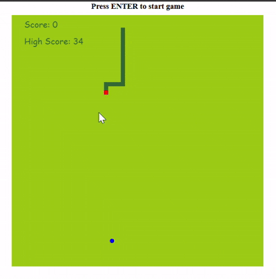

# 🐍 Snake Game

A classic arcade experience reimagined in JavaScript! Guide your serpent through an endless grid, consuming prey to grow longer while dodging your own tail and the boundaries of the game world.

## Snapshot

## Features

- **Smooth Controls**: Arrow keys for responsive gameplay
- **Score Tracking**: Watch your high score climb with each successful meal
- **Retro Aesthetics**: Pixel-perfect graphics with a modern twist
- **Responsive Design**: Play on desktop or mobile devices

## Getting Started

1. Clone this repository
2. Open `index.html` in your browser
3. Start playing immediately—no installation required

## How to Play

- Use **arrow keys** to navigate your snake
- Eat the food balls to grow and earn points
- Avoid colliding with walls and yourself
- Challenge yourself to beat your high score

## Technologies

- HTML5 Canvas
- Vanilla JavaScript
- CSS3

## License

MIT License - feel free to use and modify!

---

*How long can you survive?*